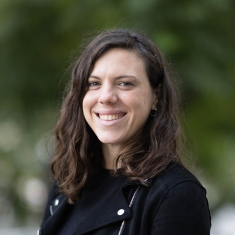
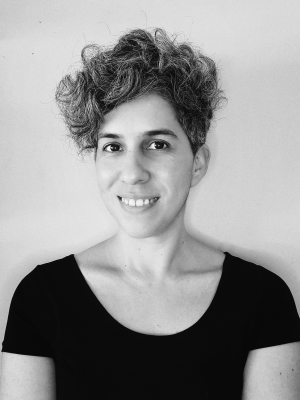
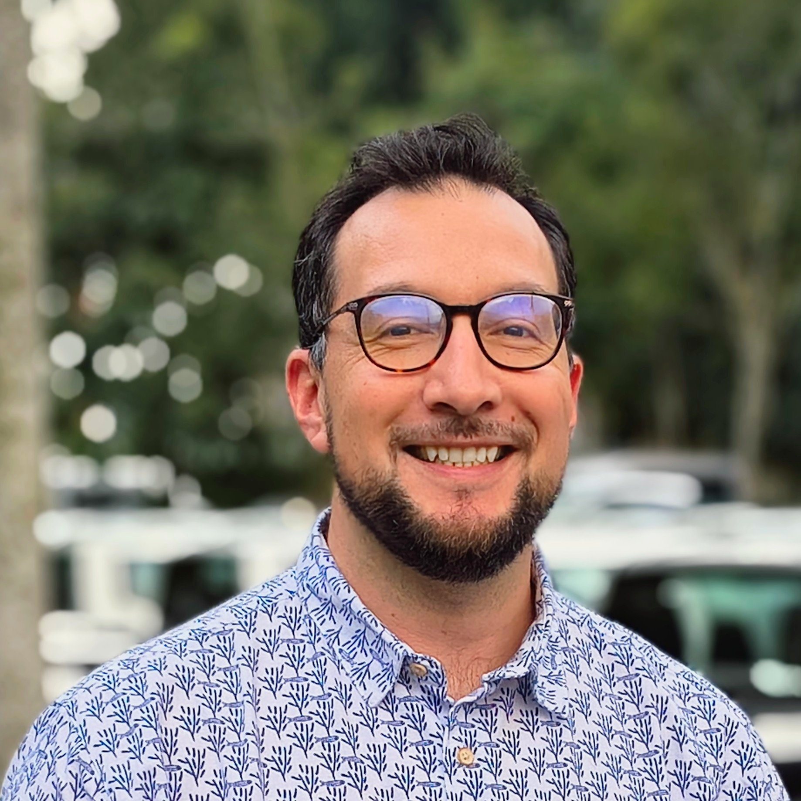
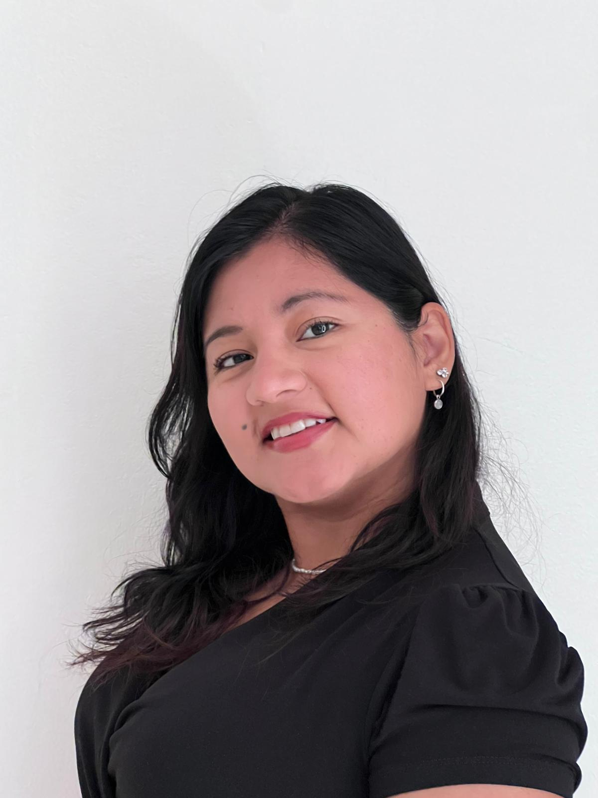
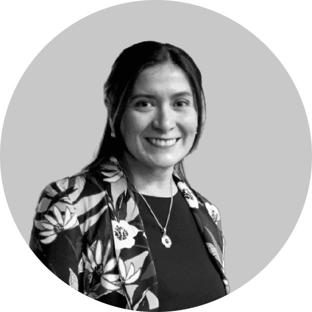
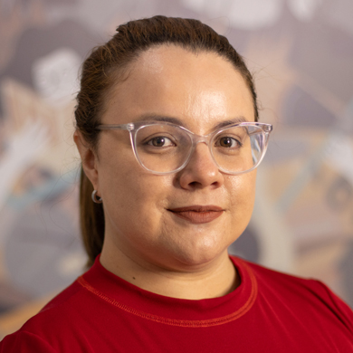

## Chairs

::: {.team-grid}

::: {.team-member}
{.team-photo}

[Jesica Formoso]{.team-name}

::: {.team-country}
🇦🇷 Argentina
:::

Doctora en Ciencias Éticas, Humanísticas y Sociales Médicas e investigadora adjunta en el [Centro Interdisciplinario de Investigaciones en Psicología Matemática y Experimental - CONICET](https://www.conicet.gov.ar/). Coorganiza [R-Ladies Buenos Aires](https://rladies.org/chapters/rladies-buenos-aires/), coordina el área de medición de impacto en [MetaDocencia](https://metadocencia.org/) y es parte de [RLadies+](https://rladies.org/about-us/global-team/) y [RSE Argentina](https://rse-argentina.github.io/).

::: {.social-links}
[](https://jformoso.github.io/)
[](https://www.linkedin.com/in/jesica-formoso-16ab4649/)
[](https://bsky.app/profile/jformoso.bsky.social)
[](https://orcid.org/0000-0003-3062-4036)

:::
:::

::: {.team-member}
{.team-photo}

[Riva Quiroga]{.team-name}

::: {.team-country}
🇨🇱 Chile
:::

Research Fellow en [OLS](https://we-are-ols.org/) y fundadora de la [Comunidad de software de Investigación de Chile (RSE Chile)](https://rse-chile.github.io/). Es Fellow del [Software Sustainability Institute](https://www.software.ac.uk/) y participa de forma activa en distintas comunidades de programación y ciencia abierta, como [RLadies+](https://rladies.org/about-us/global-team/), [LatinR](https://2025.latinr.org/sobre/equipo/), [PyLadies](https://www.pyladies.cl/) y [FORRT](https://forrt.org/about/steering-committee/).

::: {.social-links}
[](https://rivaquiroga.cl/)
[](https://www.linkedin.com/in/riva-quiroga/)
[](https://bsky.app/profile/rivaquiroga.bsky.social)
[](https://orcid.org/0000-0002-1147-4135)
:::
:::

::: {.team-member}
{.team-photo}

[Luis Verde Arregoitia]{.team-name}

::: {.team-country}
🇲🇽 México
:::

Doctor en Ciencias Biológicas. Actualmente se dedica a la ciencia de datos aplicada a biodiversidad en el [Instituto de Ecología A.C., INECOL](http://inecol.mx/). Participa en iniciativas de software de investigación y código abierto en Latinoamérica a través de la organización [rOpenSci](https://ropensci.org/es/).

::: {.social-links}
[](https://liomys.mx)
[](https://www.linkedin.com/in/luis-d-verde-arregoitia-a20339209/)
[](https://bsky.app/profile/liomys.mx)
:::
:::

:::

## Comité organizador

::: {.team-grid}

::: {.team-member}
{.team-photo}

[Pamela Pacheco Rivera]{.team-name}

::: {.team-country}
🇵🇪 Perú
:::

Bióloga e investigadora en inmunología, enfermedades infecciosas y biología molecular. Participa en proyectos de desarrollo y evaluación de estrategias terapéuticas para enfermedades autoinmunes. Comprometida con una comunidad científica colaborativa e inclusiva.

::: {.social-links}
<!-- []() -->
<!-- []() -->
<!-- []() -->
:::

:::

::: {.team-member}

{.team-photo}

[Patricia Loto]{.team-name}

::: {.team-country}
🇦🇷 Argentina
:::

Licenciada en Sistemas de Información y diplomada en Ciencia de Datos y Aprendizaje Automático. Maestranda en Tecnologías de la Información en la [UNNE]( https://www.unne.edu.ar/). Docente universitaria y desarrolladora de software y analista de datos en el sector público. Cofundadora de [RSE Argentina](https://www.linkedin.com/company/111437056/) e integrante de [LatinR](https://latin-r.com/).

::: {.social-links}

[](https://www.linkedin.com/in/patricia-loto/)

:::

:::

::: {.team-member}

{.team-photo}

[Andrea Gomez Vargas]{.team-name}

::: {.team-country}
🇦🇷 Argentina
:::

Socióloga y analista de estadísticas de población. Trabaja con datos sociodemográficos a gran escala, integrando ciencias sociales y desarrollo de software científico. Coorganiza [R en Buenos Aires](https://renbaires.github.io/quienes-somos.html) & [RSE Argentina](https://rse-argentina.github.io/quienes-somos.html), y es parte de rOpenSci y R-Ladies+.

::: {.social-links}

[](https://soyandrea.github.io/)
[](https://www.linkedin.com/in/andreasociologa/)
[](https://bsky.app/profile/goandre.bsky.social)
[](https://orcid.org/0009-0007-8745-3967)
 

:::

:::

:::
