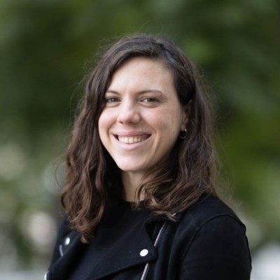
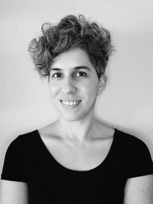
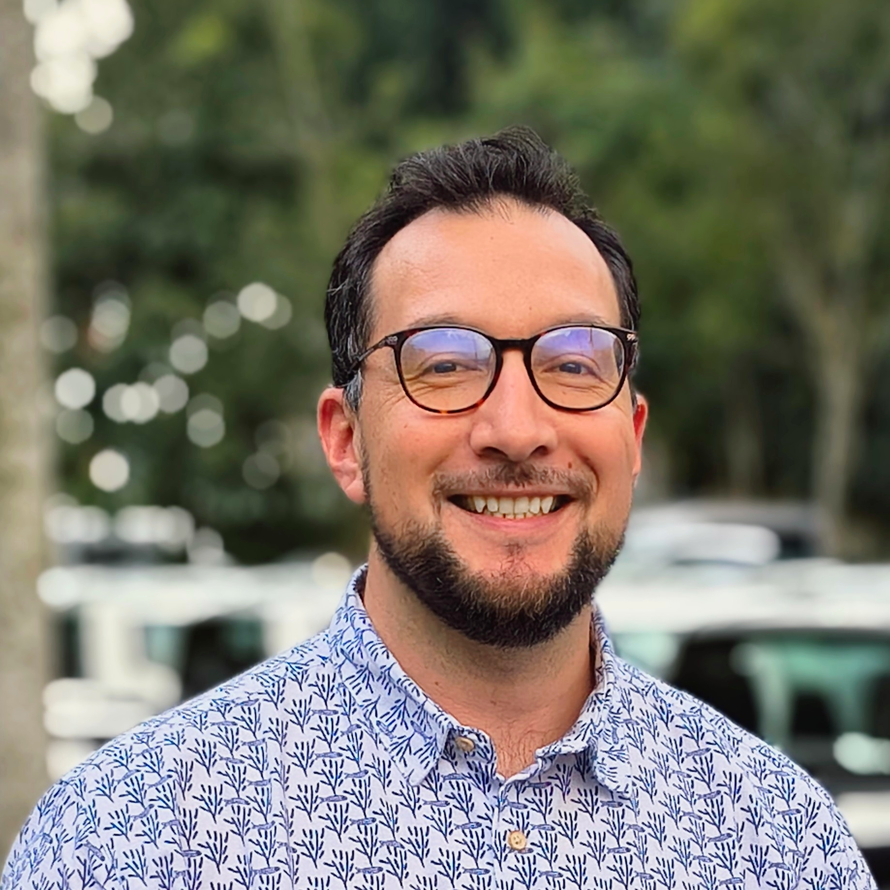
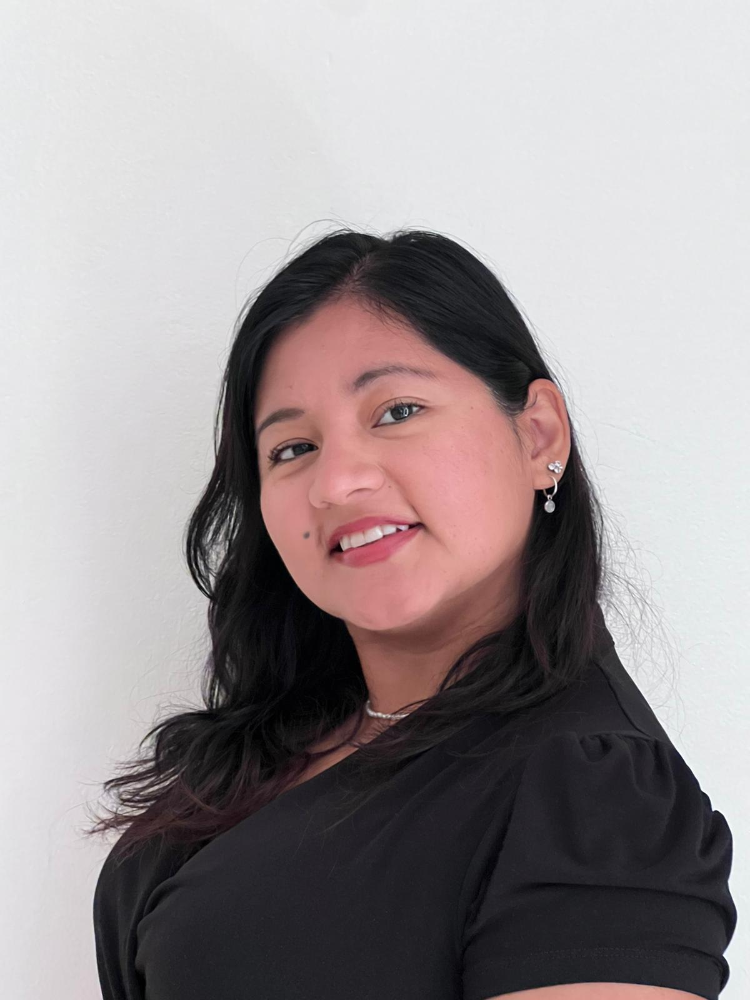
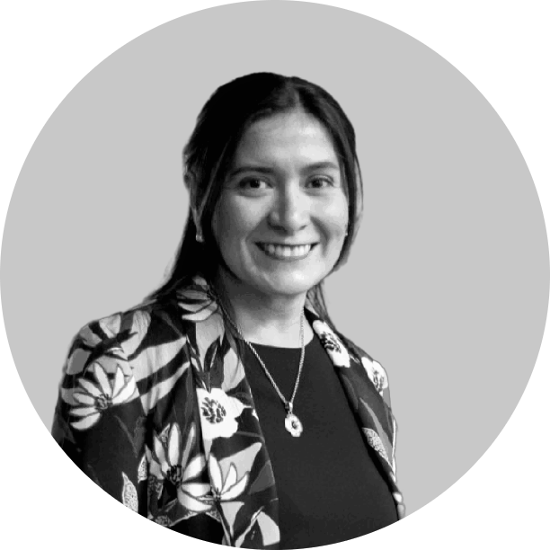
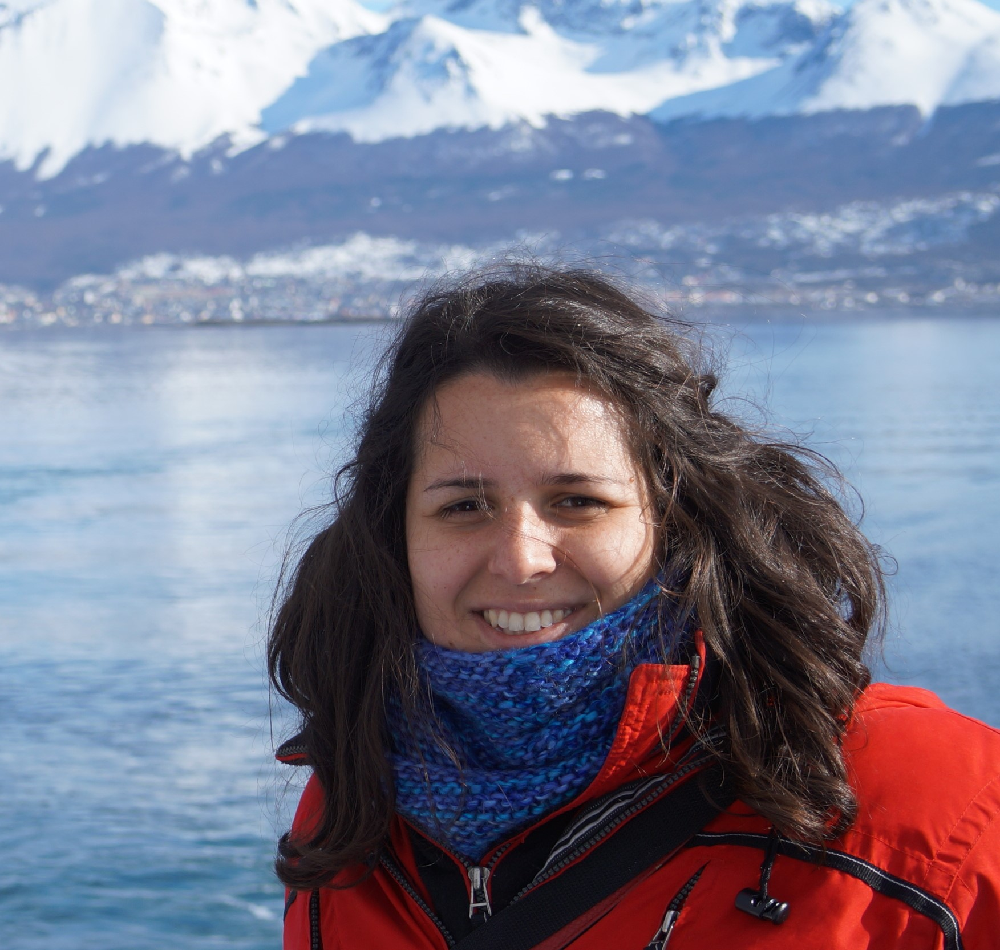
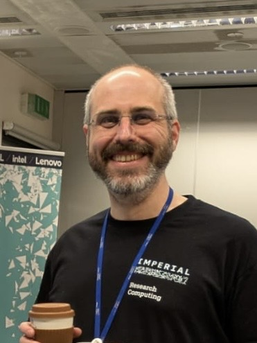
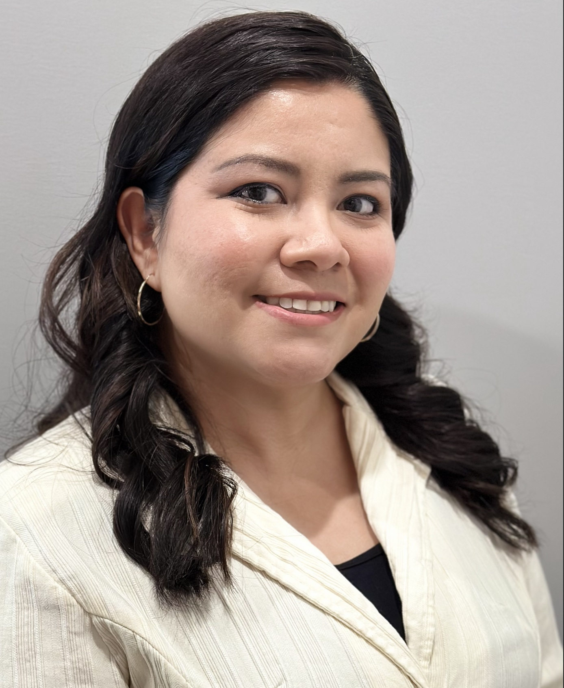

## Chairs

:::::::::::: team-grid
::::: team-member
{.team-photo}

[Jesica Formoso]{.team-name}

::: team-country
🇦🇷 Argentina
:::

Doctora en Ciencias Éticas, Humanísticas y Sociales Médicas e investigadora adjunta en el [Centro Interdisciplinario de Investigaciones en Psicología Matemática y Experimental - CONICET](https://www.conicet.gov.ar/). Coorganiza [R-Ladies Buenos Aires](https://rladies.org/chapters/rladies-buenos-aires/), coordina el área de medición de impacto en [MetaDocencia](https://metadocencia.org/) y es parte de [RLadies+](https://rladies.org/about-us/global-team/) y [RSE Argentina](https://rse-argentina.github.io/).

::: social-links
[](https://jformoso.github.io/) [](https://www.linkedin.com/in/jesica-formoso-16ab4649/) [](https://bsky.app/profile/jformoso.bsky.social) [](https://orcid.org/0000-0003-3062-4036)
:::
:::::

::::: team-member
{.team-photo}

[Riva Quiroga]{.team-name}

::: team-country
🇨🇱 Chile
:::

Research Fellow en [OLS](https://we-are-ols.org/) y fundadora de la [Comunidad de software de Investigación de Chile (RSE Chile)](https://rse-chile.github.io/). Es Fellow del [Software Sustainability Institute](https://www.software.ac.uk/) y participa de forma activa en distintas comunidades de programación y ciencia abierta, como [RLadies+](https://rladies.org/about-us/global-team/), [LatinR](https://2025.latinr.org/sobre/equipo/), [PyLadies](https://www.pyladies.cl/) y [FORRT](https://forrt.org/about/steering-committee/).

::: social-links
[](https://rivaquiroga.cl/) [](https://www.linkedin.com/in/riva-quiroga/) [](https://bsky.app/profile/rivaquiroga.bsky.social) [](https://orcid.org/0000-0002-1147-4135)
:::
:::::

::::: team-member
{.team-photo}

[Luis Verde Arregoitia]{.team-name}

::: team-country
🇲🇽 México
:::

Doctor en Ciencias Biológicas. Actualmente se dedica a la ciencia de datos aplicada a biodiversidad en el [Instituto de Ecología A.C., INECOL](http://inecol.mx/). Participa en iniciativas de software de investigación y código abierto en Latinoamérica a través de la organización [rOpenSci](https://ropensci.org/es/).

::: social-links
[](https://liomys.mx) [](https://www.linkedin.com/in/luis-d-verde-arregoitia-a20339209/) [](https://bsky.app/profile/liomys.mx)
:::
:::::
::::::::::::

## Comité organizador

::::::::: team-grid
::::: team-member
{.team-photo}

[Pamela Pacheco Rivera]{.team-name}

::: team-country
🇵🇪 Perú
:::

Bióloga e investigadora en inmunología, enfermedades infecciosas y biología molecular. Participa en proyectos de desarrollo y evaluación de estrategias terapéuticas para enfermedades autoinmunes. Comprometida con una comunidad científica colaborativa e inclusiva.

::: social-links
<!-- []() -->

<!-- []() -->

<!-- []() -->
:::
:::::

::::: team-member
{.team-photo}

[Patricia Loto]{.team-name}

::: team-country
🇦🇷 Argentina
:::

Licenciada en Sistemas de Información y diplomada en Ciencia de Datos y Aprendizaje Automático. Maestranda en Tecnologías de la Información en la [UNNE](https://www.unne.edu.ar/). Docente universitaria y desarrolladora de software y analista de datos en el sector público. Cofundadora de [RSE Argentina](https://www.linkedin.com/company/111437056/) e integrante de [LatinR](https://latin-r.com/).

::: social-links
[](https://www.linkedin.com/in/patricia-loto/)
:::
:::::
:::::::::

## Comité científico

::::::::::::::: team-grid
::::: team-member
{.team-photo}

[Virginia Garcia Alonso]{.team-name}

::: team-country
🇦🇷 Argentina
:::

Bióloga marina y doctora en Ciencias Biológicas de la Universidad de Buenos Aires, Argentina. Me especializo en análisis espaciotemporales, ciencia abierta y visualización de datos. Actualmente trabajo como Science Officer (Birds & Energy) en BirdLife International y participo en la organización de R-Ladies Buenos Aires y de la Red de Jóvenes Investigadores en Ciencias del Mar (JICMar).

::: social-links
[](https://virginiagarciaalonso.github.io/) [](www.linkedin.com/in/virginia-garcia-alonso)
:::
:::::

::::: team-member
{.team-photo}

[Yanina Bellini Saibene]{.team-name}

::: team-country
🇦🇷 Argentina
:::

rOpenSci Community Manager. Sovereing Tech Fellow 2026. R-Ladies Project Lead, Universidad Autral professor. Co-founder of LatinR and RLadies+ Santa Rosa. Member of The Carpentries Board of Directors, RLadies+ Board of Directors, R Consortium Infrastructure Steering Committee, Sociedad Argentina de Informática (SADIO). GitHub Star from 2022 to 2026. M.S. in Data Mining and Knowledge Management.

::: social-links
[](https://yabellini.netlify.app) [](https://www.linkedin.com/in/yabellini/)[](https://github.com/yabellini)
:::
:::::

::::: team-member
{.team-photo}

[Diego Alonso Álvarez]{.team-name}

::: team-country
🇪🇸 España
:::

Dr Diego Alonso Alvarez is the Head of Research Software Engineering of the central RSE Team at Imperial College London, part of the Research Computing Service. He joined the team in 2018 as an RSE, and has led it since the end of 2021.

::: social-links
[](https://profiles.imperial.ac.uk/d.alonso-alvarez) [](https://www.linkedin.com/in/dalonsoalvarez/)[](https://github.com/dalonsoa)
:::
:::::

::::: team-member
{.team-photo}

[Joselyn Chávez]{.team-name}

::: team-country
🇲🇽 México
:::

Joselyn es instructora en la escuela de medicina del hospital Mount Sinai en Nueva York. Se enfoca en el análisis de datos de transcriptómica espacial y de célula única para el estudio de cáncer y desarrollo del cerebro.

::: social-links
[](https://josschavezf.netlify.app) [](www.linkedin.com/in/joselynchavezfuentes)[](https://github.com/josschavezf)
:::
:::::
:::::::::::::::
