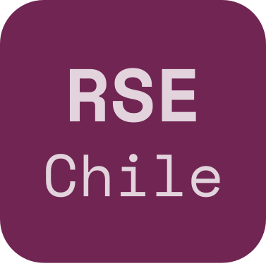
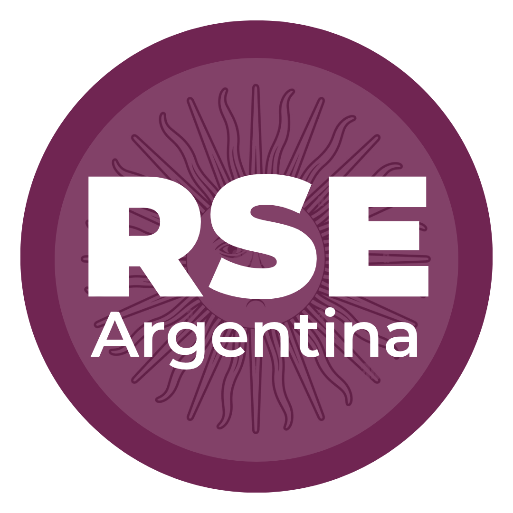
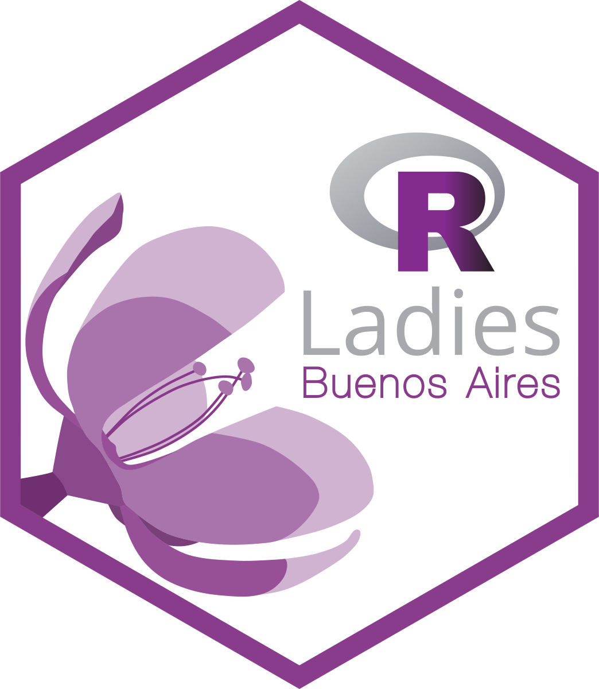
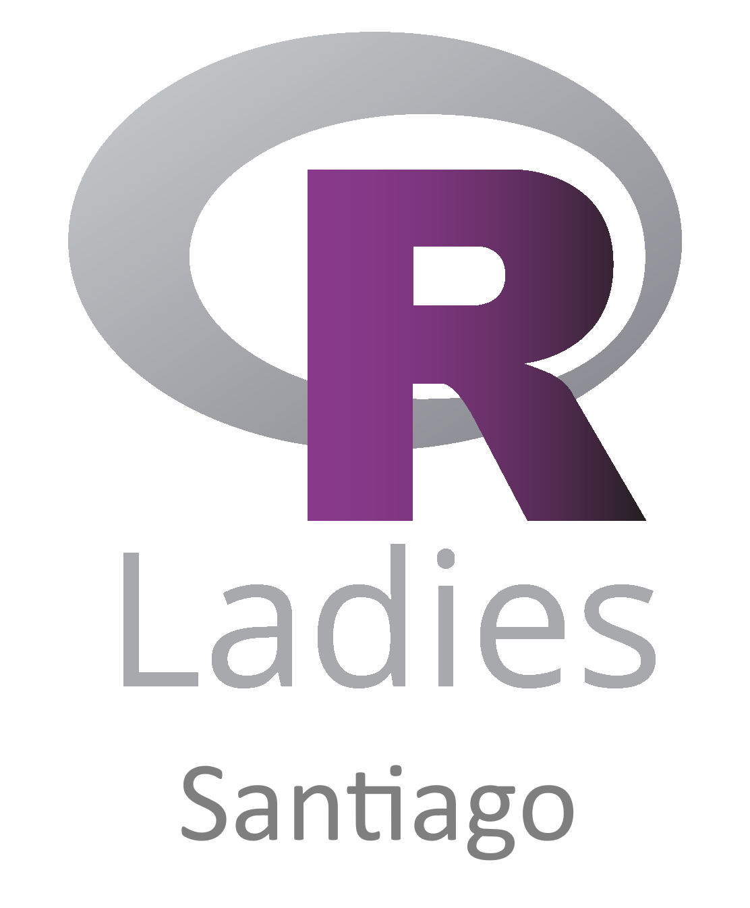
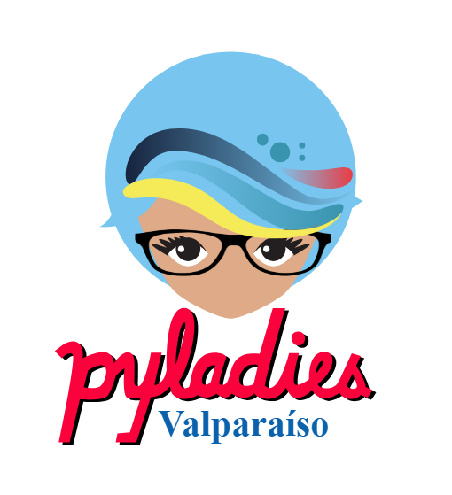

::: {.banner}

# Research Software Latinoamérica (RSLA26)

### I Conferencia internacional de software de investigación en Latinoamérica

25-28 de Agosto, 2026  
(Virtual)

[Presentación de trabajos](llamado.qmd){.btn .btn-primary .btn-lg}

:::

## Sobre la Conferencia

Research Software Latinoamérica (RSLA26) es un espacio de encuentro para quienes desarrollan, utilizan, mantienen y sostienen software de investigación en América Latina. La conferencia busca fortalecer el ecosistema regional de software científico, promoviendo el intercambio de experiencias, la colaboración y la construcción de comunidades.

En 2026, RSLA26 forma parte de un grupo coordinado de conferencias del Sur Global, [Equitable global collaboration and opportunity in Research Software (Equersa)](https://equersa.org/), que se celebrarán en Asia, Australia, Nueva Zelanda, África y América Latina durante las mismas fechas. En conjunto, estos eventos buscan generar espacios para conversaciones regionales, al tiempo que promueven el intercambio global.

En esta primera edición, RSLA busca generar espacios de diálogo sobre la construcción de soberanía tecnológica y la promoción del software de investigación para la ciencia abierta y soberana en América Latina. 

Invitamos a presentar contribuciones a todas aquellas personas que participan en el ecosistema de software de investigación, incluyendo quienes desarrollan o mantienen software, realizan investigación, trabajan con datos (generación, gestión o análisis), brindan servicios de información y bibliotecas, coordinan o impulsan comunidades, representan organismos financiadores o están comenzando su trayectoria como estudiantes.

::: {.card}

### ¿Por qué participar en RSLA26?

- Formar parte de una red global conectada
- Compartir tu trabajo con una audiencia colaborativa y comunitaria
- Aprender de profesionales de software de investigación de distintas regiones
- Contribuir al desarrollo del ecosistema de software científico en América Latina y el Sur Global

:::

::: {style="margin-top: 3rem; padding: 2rem; background: #f8f8f8; border-radius: 8px;"}

## Fechas importantes

|  | Apertura | Cierre |
|------|-------|------|
| Llamado a presentaciones | 1 de abril | 31 de mayo |
| Becas de accesibilidad |  14 de mayo | 26 de junio |
| Notificación de presentaciones | 7 de julio | --- |
| Micro becas | 14 de mayo | 10 de julio |
| Becas para tutoriales | 14 de mayo | 14 de agosto |
| Inscripción temprana | 15 de junio | 10 de julio |
| Inscripción estándar | 11 de julio | 14 de agosto |
| Conferencia | 25 de agosto | 28 d agosto |

[Enviar Propuesta](llamado.qmd){.btn .btn-primary}

:::

---

## Sponsors

::: {style="text-align: center; margin-top: 1.5rem;"}

¿Tu organización quiere ser parte? Escribí a [softwaredeinvestigacion@gmail.com](mailto:softwaredeinvestigacion@gmail.com) para conocer las opciones de patrocinio.

:::

## Comunidades vinculadas a software de investigación en Latinoamérica

::: {style="text-align: center; margin-top: 1.5rem;"}

¿Tu comunidad quiere ser parte? Escribí a [softwaredeinvestigacion@gmail.com](mailto:softwaredeinvestigacion@gmail.com) para conocer cómo sumarla a esta sección.

:::
